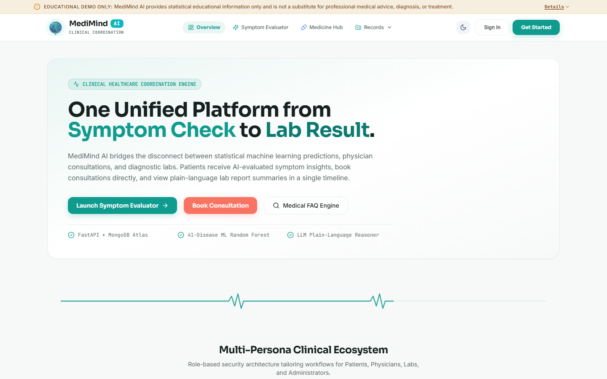
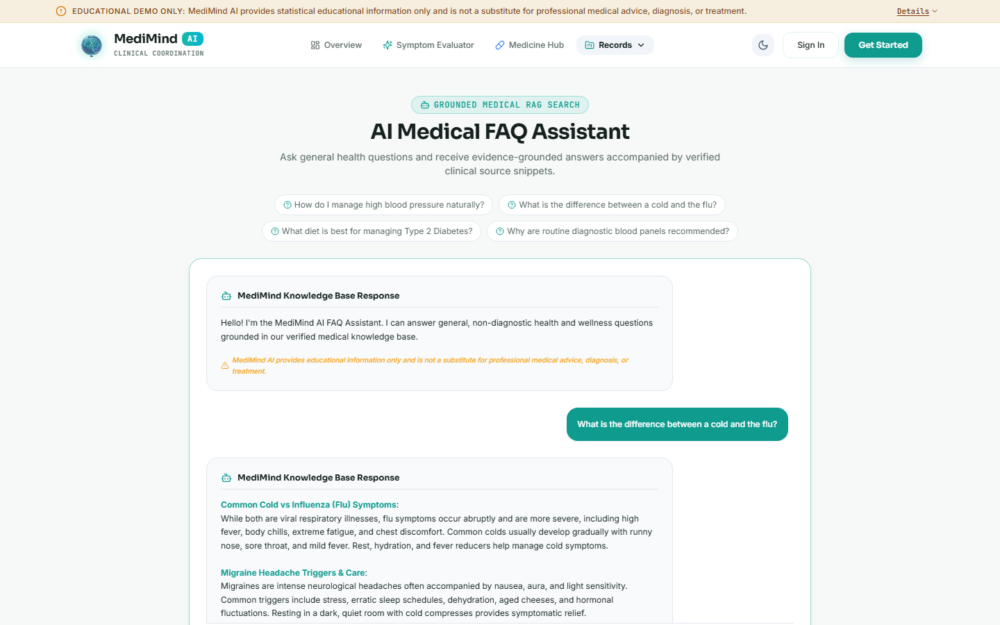
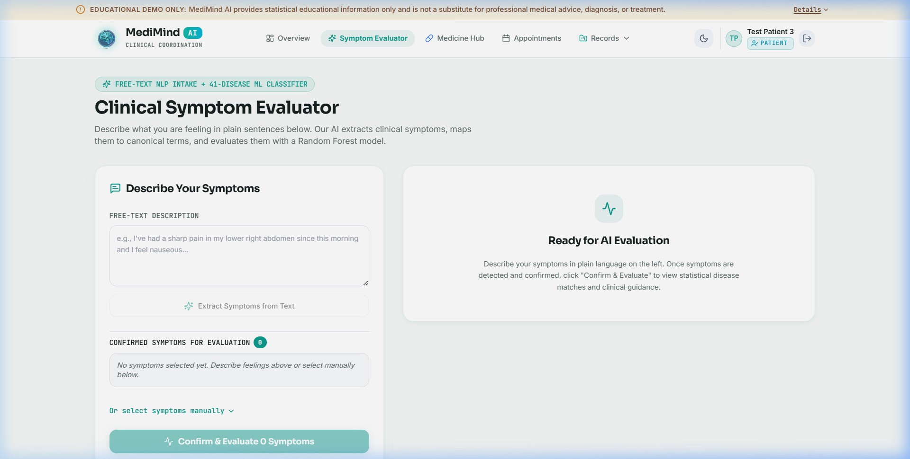
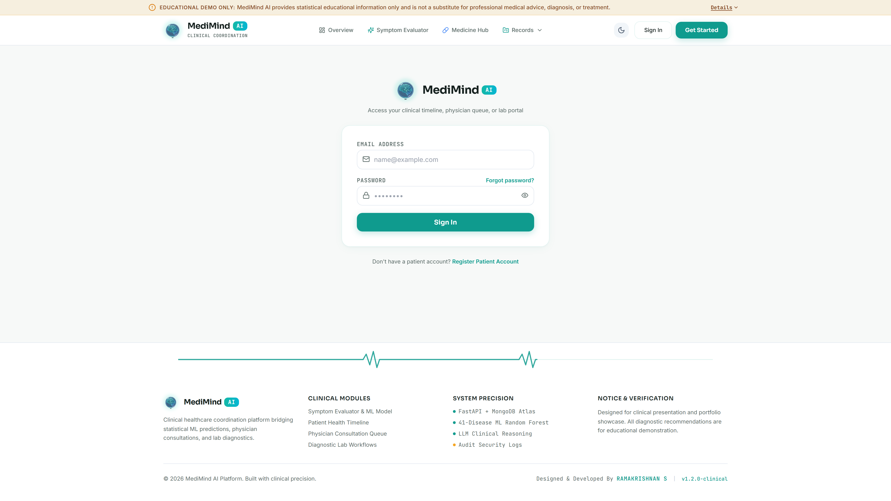
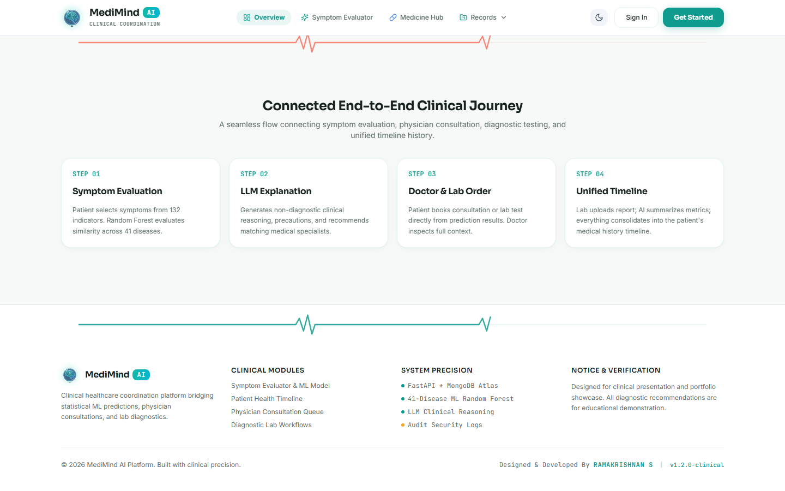

# MediMind AI — Hardened Clinical Healthcare Coordination Platform

[](https://medi-mind-ai-zeta.vercel.app)
[](https://medimind-ai-ikpa.onrender.com)
[](https://cloud.mongodb.com)


> **CRITICAL MEDICAL DISCLAIMER (NON-NEGOTIABLE):**
> **MediMind AI provides educational information only and is not a substitute for professional medical advice, diagnosis, or treatment. Medicine information is sourced from US NLM RxNorm & openFDA public datasets and does not constitute a medical prescription.**
>
> All symptom predictions are statistical pattern correlations paired with explanatory language (*"this pattern is commonly associated with X — this is not a diagnosis"*). Medicine suggestions are strictly labeled as *"educational reference only, not a prescription"*. All data in this repository is synthetic seed/demo data for portfolio demonstration.

---

## 🌐 Live Production Links

- **Frontend Application**: [https://medi-mind-ai-zeta.vercel.app](https://medi-mind-ai-zeta.vercel.app)
- **Backend API Docs (Swagger UI)**: [https://medimind-ai-ikpa.onrender.com/docs](https://medimind-ai-ikpa.onrender.com/docs)
- **Cloud Database**: MongoDB Atlas (`medimind_db`)

---

## 📌 Product Vision & Core Journey

**Positioning:**
*An AI-assisted clinical coordination platform connecting patients, doctors, and labs — from free-text symptom intake to medicine reference and lab result tracking, in one unified ecosystem.*

```
[Free-Text Symptom Intake] ➔ [LLM NLP Extraction to 132 Canonical Symptoms] ➔ [Random Forest 41-Disease Classifier + LLM Explanation] ➔ [Grounded AI Medical FAQ Engine] ➔ [Medicine Information Hub (RxNorm / openFDA)] ➔ [Doctor Consultation Booking] ➔ [Lab Report Summarization] ➔ [Unified Patient Timeline]
```

---

## 👤 User Personas & Portals

| Persona | Role | Key Functionality in MediMind AI |
| :--- | :--- | :--- |
| **Sarah Connor** | **Patient** | Free-text symptom input, AI disease predictions, RxNorm medicine lookup, doctor booking, lab results tracking. |
| **Dr. Marcus Vance** | **Doctor** | Consultation queue management, patient medical history review, pairwise drug interaction checker. |
| **Alex Rivera** | **Lab Tech** | Diagnostic test order processing, sample workflow tracking, PDF report upload & AI summarization. |
| **SysAdmin** | **System Admin** | Staff account provisioning, performance metrics monitoring, security audit trail inspection. |

---

## 📸 Interface Screenshots & Core Modules

### 1. Platform Landing Page & Hero Section

*Clinical coordination platform overview — connecting patients, doctors, and diagnostic laboratories.*

### 2. AI Medical FAQ Assistant (Grounded RAG & Intent Engine)

*Evidence-grounded medical FAQ assistant featuring formatted markdown responses, citation sources, and RapidFuzz intent matching.*

### 3. Patient Symptom Evaluator & ML Classifier

*Free-text NLP symptom intake mapping into 132 canonical symptoms and 41-disease Random Forest probability classifier.*

### 4. Medicine Information Hub (RxNorm & openFDA)

*Real-time RxNorm & openFDA drug label integration featuring autocomplete search, pairwise interaction checking, and side-effect warnings.*

### 5. Doctor Clinical Dashboard

*Doctor portal — consultation queue, patient triage overview, and diagnostic predictions.*

### 6. Admin Security Audit Dashboard

*Admin portal — system performance metrics, paginated security audit trail, and staff provisioning.*

### 7. Developer Signature Credit (Footer)

*Clean clinical footer featuring developer credit: **Designed & Developed By RAMAKRISHNAN S**.*

---

## ✨ System Architecture & Key Enhancements

```
MediMind AI
├── Free-Text NLP Symptom Intake (/api/v1/symptom-nlp/extract)
│   └── Groq/OpenAI LLM mapped strictly to 132 canonical symptoms
├── Grounded AI Medical FAQ Engine (/api/v1/faq/ask)
│   ├── Vector Similarity Search (TF-IDF) + RapidFuzz Query Spell Correction
│   └── LLM Clinical Response Generation with Formatted Markdown Rendering
├── Medicine Information Hub (/api/v1/medicines)
│   ├── RxNorm API (approximateTerm, rxcui lookup, brand/generic normalization)
│   ├── openFDA Drug Label API (indications, adult dosage, warnings, side effects)
│   └── Server-side MongoDB Cache (`medicine_cache` collection)
├── Security Audit Logging (`audit_events` collection)
│   └── Per-user event tracking (LOGIN_SUCCESS/FAILED, SIGNUP, STAFF_PROVISIONED, 401/403 failures)
└── Database Infrastructure
    └── MongoDB Atlas Cloud Database (`medimind_db` cluster)
```

---

## 🗄️ MongoDB Atlas Schema Overview

### `audit_events` Collection
```json
{
  "_id": "5f8a9e10-...",
  "action": "LOGIN_SUCCESS",
  "user_email": "patient@medimind.ai",
  "role": "patient",
  "status_code": 200,
  "details": { "user_id": "pat_demo_01" },
  "timestamp": "2026-08-31T12:00:00Z"
}
```

### `medicine_cache` Collection
```json
{
  "_id": "detail_283742",
  "rxcui": "283742",
  "generic_name": "Omeprazole",
  "brand_names": ["Prilosec"],
  "drug_class": "Proton Pump Inhibitors (PPIs)",
  "indications": "Treatment of gastroesophageal reflux disease (GERD)...",
  "dosage_and_administration": "Standard labeled dosage — reference only...",
  "is_prescription_required": true,
  "common_side_effects": ["Headache", "Nausea", "Abdominal pain"],
  "cached_at": "2026-08-31T12:00:00Z"
}
```

---

## 🧪 Automated Test Suite

Run the automated backend test suite covering appointment booking, timeline timestamping, NLP symptom extractions, and Medicine Hub endpoints:

```bash
cd backend
python -m unittest tests/test_suite.py
```

Output:
```text
[NLP Test 1] Input: "I've had a sharp pain in my lower right..." -> Matched: ['Nausea', 'Abdominal Pain'] (Confidence: high)
[NLP Test 2] Input: "Splitting headache with sensitivity to li..." -> Matched: ['Headache', 'Visual Disturbances', 'Dizziness'] (Confidence: high)
...
Ran 4 tests in 2.845s
OK
```

---

## 🚀 Local Quickstart Setup

### 1. Backend Setup (FastAPI & MongoDB Atlas)
```bash
cd backend
python -m venv venv
.\venv\Scripts\activate
pip install -r requirements.txt
# Set your MongoDB Atlas URI in backend/.env:
# MONGODB_URI=mongodb+srv://<username>:<password>@cluster0.mongodb.net/medimind_db?appName=Cluster0
python main.py
```
*Backend runs on `http://127.0.0.1:8000`. Interactive OpenAPI docs at `http://127.0.0.1:8000/docs`.*

### 2. Frontend Setup (Next.js 14 & Tailwind)
```bash
cd frontend
npm install
npm run dev
```
*Frontend runs on `http://localhost:3000`.*

---

## 👨‍💻 Developer & Author

**Designed & Developed By RAMAKRISHNAN S**  
*Built with clinical precision for portfolio demonstration.*
