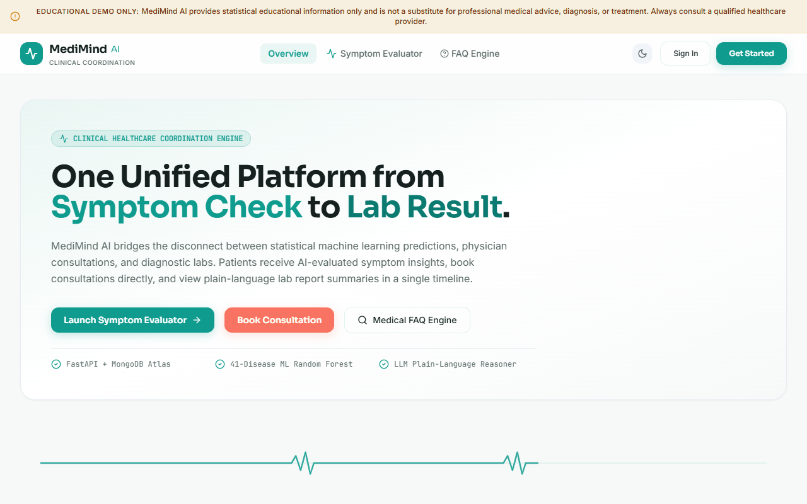
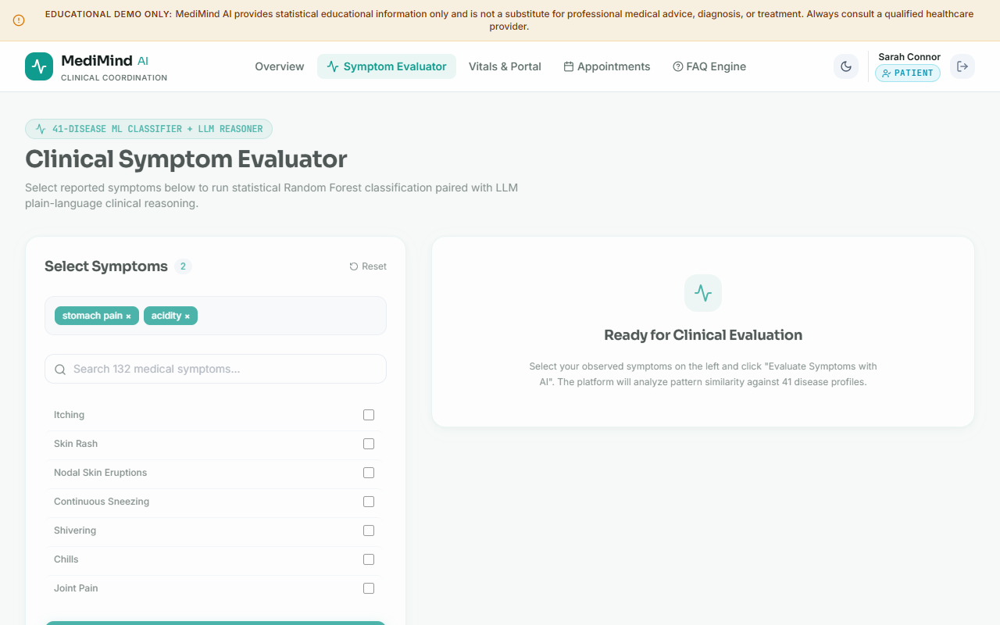
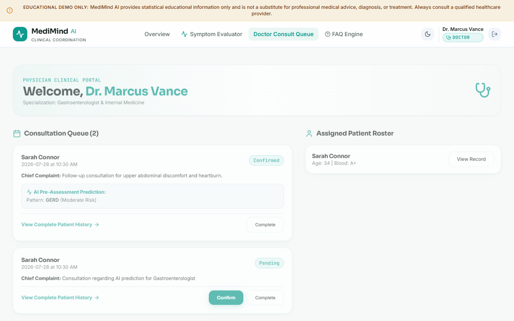
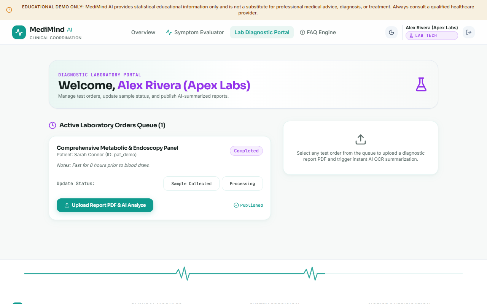
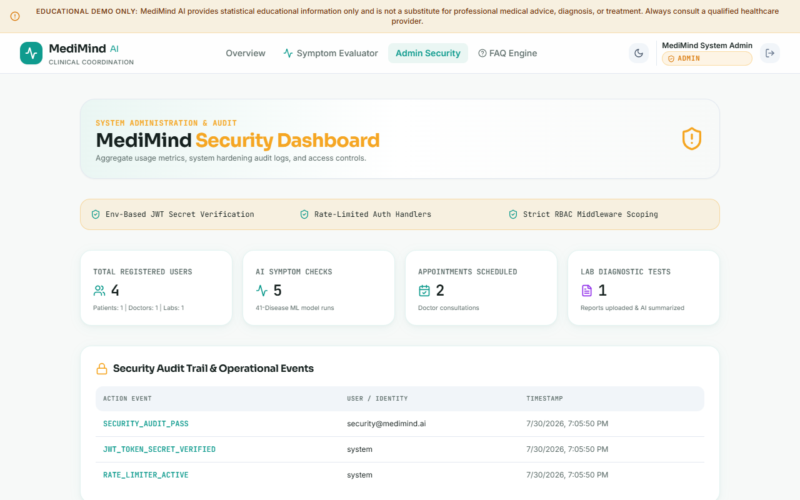

# MediMind AI - Hardened Clinical Healthcare Coordination Platform



> **CRITICAL MEDICAL DISCLAIMER (NON-NEGOTIABLE):**
> **MediMind AI provides educational information only and is not a substitute for professional medical advice, diagnosis, or treatment. Medicine information is sourced from US NLM RxNorm & openFDA public datasets and does not constitute a medical prescription.**
>
> All symptom predictions are statistical pattern correlations paired with explanatory language (*"this pattern is commonly associated with X — this is not a diagnosis"*). Medicine suggestions are strictly labeled as *"educational reference only, not a prescription"*. All data in this repository is synthetic seed/demo data for portfolio demonstration.

---

## 📌 Product Vision & Positioning

**One-line Positioning:**
*An AI-assisted healthcare coordination platform connecting patients, doctors, and labs — from free-text symptom intake to medicine reference and lab result, in one place.*

**The Core Journey:**
```
[Free-Text Symptom Intake] ➔ [LLM NLP Extraction to 132 Canonical Symptoms] ➔ [Random Forest 41-Disease Classifier + LLM Explanation] ➔ [Medicine Information Hub (RxNorm / openFDA)] ➔ [Doctor Consultation Booking] ➔ [Lab Processing & Report Analysis] ➔ [Unified Patient Timeline]
```

---

## 👤 User Personas

| Persona | Role | Key Goal in MediMind AI |
| :--- | :--- | :--- |
| **Sarah Connor** | **Patient** | Describe symptoms in natural text, review AI predictions and RxNorm medicine details, book doctors/labs, track vitals. |
| **Dr. Marcus Vance** | **Doctor** | Inspect consultation queue, review patient medical history and predictions, check pairwise drug interactions. |
| **Alex Rivera** | **Lab Tech** | Receive diagnostic test orders, update sample status workflow, upload report PDFs for AI summarization. |
| **SysAdmin** | **System Admin** | Provision staff accounts with temporary passwords, monitor metrics, inspect per-user security audit events. |

---

## 🗺️ System Architecture & New Modules

```
MediMind AI
├── Free-Text NLP Symptom Intake (/api/v1/symptom-nlp/extract)
│   └── Groq/OpenAI LLM constrained to canonical 132-symptom vocabulary
├── Medicine Information Hub (/api/v1/medicines)
│   ├── RxNorm API (approximateTerm, rxcui lookup, brand/generic normalization)
│   ├── openFDA Drug Label API (indications, labeled adult dosage, warnings, side effects)
│   └── Server-side MongoDB Cache (`medicine_cache` collection)
├── Security Audit Logging (`audit_events` collection)
│   └── Per-user event tracking (LOGIN_SUCCESS/FAILED, SIGNUP, STAFF_PROVISIONED, 401/403 failures)
└── Temporary Staff Password Reset Flow
    └── `must_reset_password` flag enforcing forced password update on first staff login
```

---

## 📸 Screenshots

### Patient Dashboard

*Patient portal — vitals tracking, symptom checker access, and appointment history.*

### Doctor Dashboard

*Doctor portal — consultation queue, patient triage overview, and symptom predictions.*

### Lab Dashboard

*Lab technician portal — pending test order queue and result entry interface.*

### Admin Security Dashboard

*Admin portal — system performance metrics, paginated security audit trail, and staff provisioning.*

---

## ✨ Features Built & Hardened

- **Free-Text NLP Symptom Intake**: Single free-text textarea where patients describe feelings in natural language ("I've had a sharp pain in my lower right abdomen since this morning and I feel nauseous"), extracted and mapped strictly into 132 canonical symptoms.
- **Interactive Symptom Tag Confirmation**: Step-by-step confirmation allowing patients to add/remove/correct symptoms before running the 41-disease ML classifier.
- **Medicine Information Hub**: Complete reference engine integrated with RxNorm and openFDA APIs, server-side cached in `medicine_cache`. Features autocomplete search, condition reverse lookup, pairwise interaction checker, and prescription warning badges.
- **Audit Logging & Security Hardening**: Dedicated `audit_events` collection capturing actor, action, timestamp, and details for logins, signups, staff provisioning, report uploads, and 401/403 authorization failures.
- **Forced Temporary Password Reset**: Staff accounts provisioned by Admin with temporary passwords are flagged `must_reset_password: True` and forced to change passwords via `/auth/reset-password` on first login.
- **Lab Order Unique IDs**: Format persisted as `labtest_<uuid_hex>` so unique order suffixes are fully preserved and displayed.
- **Real Event Timeline Timestamps**: Every timeline event writes real-time UTC timestamps (`datetime.now(timezone.utc)`) at execution time.
- **Appointment Past Date Validation**: Booking form rejects dates prior to today with HTTP 400, and past appointments automatically display as `Past`.

---

## 🗄️ MongoDB Atlas Collections Schema

### `audit_events` Collection
```json
{
  "_id": "5f8a9e10-...",
  "action": "LOGIN_SUCCESS",
  "user_email": "patient@medimind.ai",
  "role": "patient",
  "status_code": 200,
  "details": { "user_id": "pat_demo_01" },
  "timestamp": "2026-08-23T22:00:00Z"
}
```

### `medicine_cache` Collection
```json
{
  "_id": "detail_283742",
  "rxcui": "283742",
  "generic_name": "Omeprazole",
  "brand_names": ["Prilosec"],
  "drug_class": "Proton Pump Inhibitors (PPIs)",
  "indications": "Treatment of gastroesophageal reflux disease (GERD)...",
  "dosage_and_administration": "Standard labeled dosage — not a personalized prescription...",
  "is_prescription_required": true,
  "common_side_effects": ["Headache", "Nausea", "Abdominal pain"],
  "cached_at": "2026-08-23T22:00:00Z"
}
```

---

## 🧪 Automated Testing

Run the automated test suite covering appointment slot booking, timeline timestamp ordering, 5 NLP symptom extraction examples, and Medicine Hub endpoints:

```bash
cd backend
python -m unittest tests/test_suite.py
```

Output:
```
[NLP Test 1] Input: "I've had a sharp pain in my lower right..." -> Matched: ['Nausea', 'Abdominal Pain'] (Confidence: high)
[NLP Test 2] Input: "Splitting headache with sensitivity to li..." -> Matched: ['Headache', 'Visual Disturbances', 'Dizziness'] (Confidence: high)
...
Ran 4 tests in 2.845s
OK
```

---

## 🚀 Local Quickstart & Setup Instructions

### 1. Backend Setup (FastAPI & MongoDB Atlas)
```bash
cd backend
python -m venv venv
.\venv\Scripts\activate
pip install -r requirements.txt
# Set your MongoDB Atlas connection URI in backend/.env:
# MONGODB_URI=mongodb+srv://<username>:<password>@cluster0.mongodb.net/medimind_db?retryWrites=true&w=majority
python main.py
```
*Backend runs on `http://127.0.0.1:8000`. Interactive docs at `http://127.0.0.1:8000/docs`.*

### 2. Frontend Setup (Next.js 14)
```bash
cd frontend
npm install
npm run dev
```
*Frontend runs on `http://localhost:3000`.*
